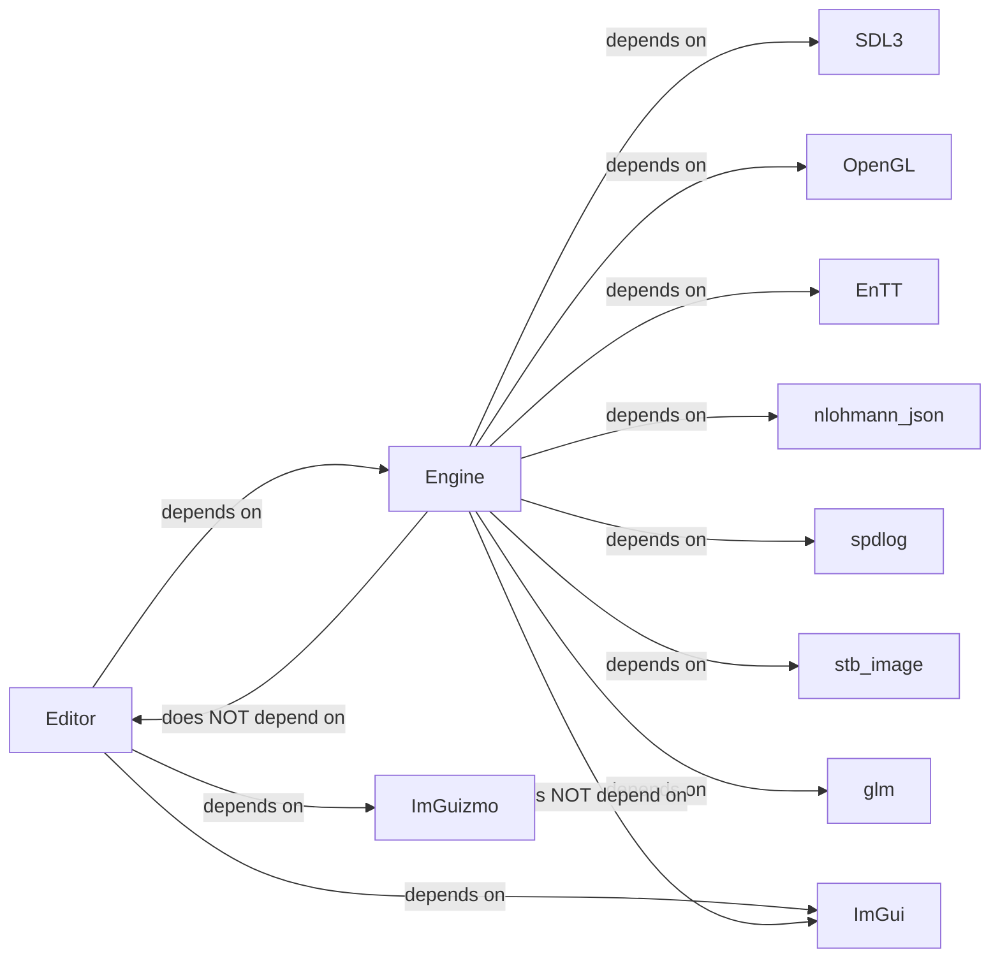
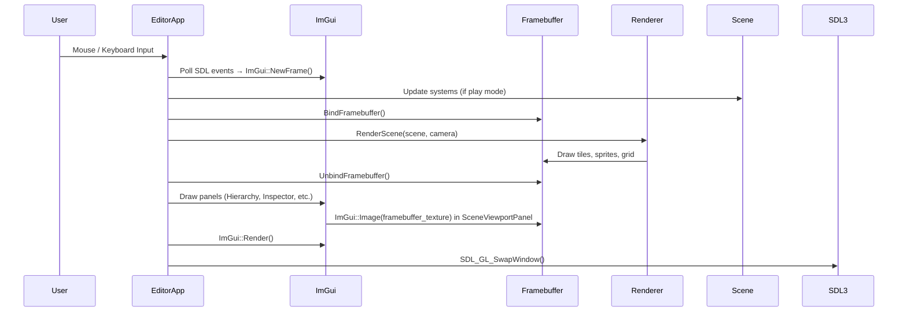

# 03 — Architecture

---

## Overview

IsoForge Editor is structured as a layered architecture with a strict boundary between the runtime engine and the editor application. The editor application hosts the engine, but the engine does not know about the editor.

The architecture has four major concerns:

1. **Engine** — reusable runtime systems (renderer, scene, assets, serialization, input, platform).
2. **Editor** — editor application, panels, commands, and UI state.
3. **Project/Game Data** — scenes, tilemaps, assets, and project configuration files.
4. **Third-Party Libraries** — external dependencies.

---

## Layer Model

```
┌─────────────────────────────────────────────────────────────┐
│                        Editor Layer                          │
│  EditorApp, Panels, Commands, EditorCamera, SelectionState  │
│                        (editor/)                            │
├─────────────────────────────────────────────────────────────┤
│                        Engine Layer                          │
│  Renderer, Scene/ECS, AssetManager, Serializer, Input,      │
│  Platform, IsometricSystem, Logger                           │
│                        (engine/)                            │
├─────────────────────────────────────────────────────────────┤
│                    Third-Party Libraries                     │
│  SDL3, OpenGL, Dear ImGui, EnTT, nlohmann/json,             │
│  spdlog, stb_image, glm, ImGuizmo                           │
│                       (third_party/)                         │
└─────────────────────────────────────────────────────────────┘
         │
         ▼
  Project Data (sandbox_project/)
  scenes/, assets/, tilemaps/, project.json
```

**Key rule**: Arrows point **downward only**. The editor depends on the engine. The engine does not depend on the editor. Neither depends on project data at compile time.

---

## High-Level Architecture Diagram

```mermaid
graph TD
    subgraph Editor ["editor/"]
        EA[EditorApp]
        SVP[SceneViewportPanel]
        HP[HierarchyPanel]
        IP[InspectorPanel]
        ABP[AssetBrowserPanel]
        TPP[TilePalettePanel]
        CP[ConsolePanel]
        EC[EditorCamera]
        ESS[EditorSelectionState]
    end

    subgraph Engine ["engine/"]
        WIN[Platform / Window]
        INP[Input]
        REN[Renderer]
        FB[Framebuffer]
        SC[Scene / ECS]
        ISO[IsometricSystem]
        ASS[AssetManager]
        SER[Serialization]
        LOG[Logger]
    end

    subgraph ThirdParty ["third_party/"]
        SDL[SDL3]
        OGL[OpenGL 3.3]
        IMGUI[Dear ImGui]
        ENTT[EnTT]
        JSON[nlohmann/json]
        SPDLOG[spdlog]
        STB[stb_image]
        GLM[glm]
        GIZMO[ImGuizmo]
    end

    subgraph Project ["sandbox_project/"]
        PJ[project.json]
        SCENES[scenes/]
        ASSETS[assets/]
        TILES[tilemaps/]
    end

    EA --> SVP & HP & IP & ABP & TPP & CP
    EA --> WIN & INP & REN & SC & ISO & ASS & SER & LOG
    SVP --> FB
    REN --> FB
    REN --> OGL
    WIN --> SDL
    INP --> SDL
    SC --> ENTT
    SER --> JSON
    LOG --> SPDLOG
    ASS --> STB
    EA --> IMGUI & GIZMO
    REN --> GLM
    SC --> GLM
    ISO --> GLM

    SER -.->|reads/writes| SCENES & TILES & PJ
    ASS -.->|loads| ASSETS
```



---

## Dependency Graph



---

## Editor Data Flow Diagram



---

## Module Responsibilities

### Platform (`engine/platform/`)

Responsible for:
- Creating and destroying the SDL3 window.
- Creating and managing the OpenGL context.
- Delivering raw input events from SDL3.

Must not: contain rendering logic, ECS logic, or UI logic.

---

### Input (`engine/input/`)

Responsible for:
- Translating SDL3 events into engine-level input state.
- Tracking mouse position, button state, scroll delta.
- Tracking keyboard key state.

Must not: forward events directly to ImGui (ImGui has its own SDL3 backend).

---

### Renderer (`engine/renderer/`)

Responsible for:
- Managing OpenGL state (VAO, VBO, shaders, textures).
- Rendering 2D sprites and tiles to a framebuffer.
- Managing the scene framebuffer object.
- Providing a simple batch renderer for quads.

Must not: contain ImGui calls. Must not know about editor panels.

---

### IsometricSystem (`engine/iso/`)

Responsible for:
- Converting between grid, world, and screen coordinate spaces.
- Computing the hovered tile under the mouse cursor.
- Providing the grid rendering function.

Must not: contain any rendering code other than calling the Renderer. Must not contain ECS logic.

---

### Scene / ECS (`engine/scene/`)

Responsible for:
- Owning the `entt::registry`.
- Providing a `Scene` class and an `Entity` wrapper.
- Defining all component structs.
- Running system update and render loops.

Must not: contain editor selection state. Must not contain ImGui calls.

---

### AssetManager (`engine/assets/`)

Responsible for:
- Loading textures from disk using stb_image.
- Caching loaded textures by path.
- Providing a missing-texture fallback.
- Unloading unused textures.

Must not: scan or display an asset browser. Must not contain ImGui calls.

---

### Serialization (`engine/serialization/`)

Responsible for:
- Serializing and deserializing `Scene` objects to/from JSON.
- Serializing and deserializing `Tilemap` objects to/from JSON.
- Reading and writing `project.json`.

Must not: serialize editor-only state (selection, layout). That is the editor's responsibility.

---

### Logger (`engine/core/`)

Responsible for:
- Initializing spdlog loggers per category.
- Providing a global logging interface (`LOG_ENGINE_INFO`, `LOG_RENDERER_WARN`, etc.).
- Registering sinks (console sink, ImGui sink).

Must not: contain ImGui panel code. The ImGui console sink is a thin bridge.

---

### EditorApp (`editor/`)

Responsible for:
- Owning the main loop.
- Owning all engine systems.
- Creating and updating all editor panels.
- Handling the docking layout.
- Routing input between ImGui and the scene viewport.
- Coordinating play/stop mode (later).

Must not: contain rendering logic. Must not contain ECS system logic.

---

## Ownership Rules

| Owner | Owns |
|---|---|
| EditorApp | All panels, engine instances, main loop |
| Scene | entt::registry, all entities |
| Renderer | All OpenGL objects (VAO, VBO, shaders, FBO) |
| AssetManager | All loaded texture handles |
| Serialization | No runtime objects; only converts to/from JSON |

---

## Dependency Direction Rules

1. `editor/` may depend on `engine/`.
2. `engine/` must never depend on `editor/`.
3. `engine/` may depend on `third_party/`.
4. `editor/` may depend on `third_party/` (ImGui, ImGuizmo).
5. Project data (`sandbox_project/`) is never a compile-time dependency. It is runtime file data only.
6. No circular dependencies between modules within `engine/`.

---

## Design Principles Applied

- **RAII everywhere**: OpenGL handles, SDL windows, and file handles are wrapped in RAII types.
- **No raw owning pointers**: Use `std::unique_ptr` for owned resources, `std::shared_ptr` only when shared ownership is genuinely needed, raw pointers only for non-owning references.
- **No global state**: Loggers are initialized once and passed via reference or accessor. No global singletons for renderer or scene.
- **Small files**: Each class lives in its own header and implementation file. No 2000-line god files.
- **No premature abstractions**: Do not create abstract interfaces until a second implementation is actually needed.
