# 05 — Runtime / Editor Separation

This is one of the most important architectural rules in IsoForge Editor. Violating it early will cause increasing pain as the project grows.

---

## What Is Runtime Code?

Runtime code is code that would be needed to **run a game** produced by the editor, without the editor being present.

Runtime code includes:
- The renderer (OpenGL draw calls, shaders, framebuffers, textures)
- The ECS scene system (EnTT registry, entities, components)
- The asset manager (texture loading and caching)
- The isometric math system (coordinate conversion, tile picking)
- The serialization system (reading scene and tilemap files)
- The input system (reading keyboard and mouse state)
- The platform layer (SDL3 window, OpenGL context)
- The logger (spdlog initialization and output)

Runtime code lives in `engine/`.

---

## What Is Editor Code?

Editor code is code that **only exists to support the editor application**. It is never needed to run a game.

Editor code includes:
- All Dear ImGui panel classes (SceneViewportPanel, HierarchyPanel, etc.)
- The EditorApp class (owns the main loop in editor mode)
- The editor camera (different viewport behavior from a game camera)
- Editor selection state (which entity or tile is currently selected)
- Editor commands (undo/redo history — later)
- Editor settings persistence (docking layout, preferences — later)
- `main.cpp` (the editor entry point)

Editor code lives in `editor/`.

---

## The Separation Rule

```
engine/ → must NEVER #include anything from editor/
editor/ → may freely #include from engine/
```

This is a strict one-way dependency. The engine is the lower layer. The editor is the upper layer.

---

## Separation Diagram

```mermaid
graph TB
    subgraph editor ["editor/ (upper layer)"]
        EA[EditorApp]
        SVP[SceneViewportPanel]
        HP[HierarchyPanel]
        IP[InspectorPanel]
        CP[ConsolePanel]
        EC[EditorCamera]
    end

    subgraph engine ["engine/ (lower layer)"]
        SC[Scene]
        REN[Renderer]
        ASS[AssetManager]
        ISO[IsoMath]
        SER[Serializer]
        LOG[Logger]
        WIN[Window]
    end

    editor -->|allowed| engine
    engine -.->|FORBIDDEN| editor

    style editor fill:#1a3a5c,stroke:#4a90d9
    style engine fill:#1a3a1a,stroke:#4aaa4a
```



---

## Why This Matters

If editor code leaks into the engine:
- The engine cannot be used without the editor.
- Shipping a game requires shipping editor code.
- Adding a headless server mode, a test runner, or a different front-end becomes very difficult.
- ImGui calls inside the renderer create a mess that is painful to untangle later.
- The engine becomes untestable in isolation.

If this separation is maintained from the start:
- The engine is a clean library that can be tested independently.
- A future "game player" (a stripped-down runtime without the editor) can use `engine/` directly.
- The editor can be replaced or redesigned without touching the engine.

---

## Allowed Dependencies

| Code in | May depend on |
|---|---|
| `editor/` | `engine/`, `third_party/imgui`, `third_party/imguizmo` |
| `engine/` | `third_party/SDL3`, `third_party/opengl`, `third_party/entt`, `third_party/nlohmann`, `third_party/spdlog`, `third_party/stb`, `third_party/glm` |

---

## Forbidden Dependencies

| Code in | Must NEVER depend on |
|---|---|
| `engine/` | `editor/` |
| `engine/` | `third_party/imgui` |
| `engine/` | `third_party/imguizmo` |
| `engine/core/` | `engine/renderer/` (core is the lowest layer) |
| `engine/renderer/` | `engine/scene/` (renderer is driven by scene, not dependent on it) |

---

## Example: Correct Separation

**Scenario**: The scene viewport panel needs to render the scene and display it.

```
editor/panels/SceneViewportPanel.cpp
    → calls engine/renderer/Renderer::RenderScene(scene, camera)
    → calls engine/renderer/Framebuffer::GetColorAttachmentID()
    → passes texture ID to ImGui::Image()
```

The renderer renders. The panel displays. The renderer does not know ImGui exists.

---

## Example: Correct — Logger with ImGui Console Sink

The engine logger can have a custom sink registered by the editor. The sink itself is in `editor/`, but spdlog's sink registration API lives in the engine logger initialization.

```cpp
// editor/EditorApp.cpp
auto consoleSink = std::make_shared<ConsolePanelSink>(consolePanel);
Log::AddSink(consoleSink);  // engine/core/Log.h provides AddSink()
```

The engine logger does not know about ImGui. The editor registers a bridge sink. This is the correct way to extend the logger from the editor layer.

---

## Example: Bad Separation — DO NOT DO THIS

```cpp
// engine/renderer/Renderer.cpp  ← WRONG
#include <imgui.h>

void Renderer::RenderDebugOverlay() {
    ImGui::Text("Draw calls: %d", m_drawCallCount);  // ← ImGui in engine code!
}
```

This is wrong because:
- The engine now depends on ImGui.
- The engine cannot be compiled without ImGui.
- ImGui is an editor concern, not an engine concern.
- Debug overlays should be drawn by a panel in `editor/`, not by the renderer.

**Fix**: The renderer exposes a `GetStats()` method. The editor panel reads `GetStats()` and draws the ImGui text.

---

## Example: Bad Separation — DO NOT DO THIS

```cpp
// engine/scene/Scene.cpp  ← WRONG
#include "editor/EditorSelectionState.h"

void Scene::Update() {
    if (EditorSelectionState::GetSelectedEntity().IsValid()) {
        // highlight selected entity
    }
}
```

This is wrong because:
- The scene now knows about the editor selection system.
- The scene cannot run without the editor.
- Selection is an editor concept, not a runtime concept.

**Fix**: The editor passes the selected entity as a parameter to the renderer or handles highlighting entirely in the editor layer.

---

## Checking the Separation

A simple check: can `engine/` compile into a static library without `editor/` being present? If yes, the separation is maintained. If the engine target fails to compile without the editor, there is a leak.

The CMake engine target (`IsoForgeEngine`) must have no dependency on the editor target (`IsoForgeEditor`).
