# 18 — Workflow & Working Diagrams

This file documents the **practical working flow** of the isometric tile-map editor and its runtime engine.  
All diagrams are written in Mermaid and are intended to be implementation-oriented — every node maps to a real module, class, or decision point that Codex must respect when writing code.

---

## Cross-Reference

| Related Document | Topic |
|---|---|
| [03_ARCHITECTURE.md](03_ARCHITECTURE.md) | Module layout and layer boundaries |
| [05_RUNTIME_EDITOR_SEPARATION.md](05_RUNTIME_EDITOR_SEPARATION.md) | Editor / runtime boundary rules |
| [06_RENDERING_AND_VIEWPORT.md](06_RENDERING_AND_VIEWPORT.md) | Framebuffer, Renderer2D, OpenGL context |
| [07_ISOMETRIC_SYSTEM.md](07_ISOMETRIC_SYSTEM.md) | Isometric coordinate math |
| [08_SCENE_AND_ECS.md](08_SCENE_AND_ECS.md) | EnTT scene, entity lifecycle |
| [09_SERIALIZATION.md](09_SERIALIZATION.md) | Scene / tilemap JSON format |
| [11_EDITOR_PANELS.md](11_EDITOR_PANELS.md) | Panel responsibilities and APIs |
| [15_DEVELOPMENT_PHASES.md](15_DEVELOPMENT_PHASES.md) | MVP roadmap phases |
| [16_CODEX_TASK_RULES.md](16_CODEX_TASK_RULES.md) | Rules for Codex task execution |

---

## 1 — Overall Editor Working Flow

Shows the complete lifecycle from process start to clean shutdown.

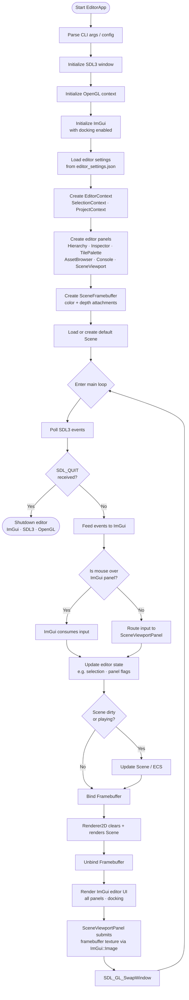

---

## 2 — Frame Loop Working Diagram

Shows every step that executes once per rendered frame.

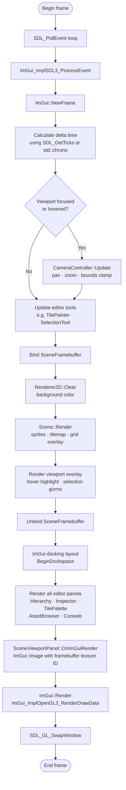

---

## 3 — Scene Viewport Input Routing Diagram

Shows how every mouse/keyboard event is dispatched to the correct consumer.

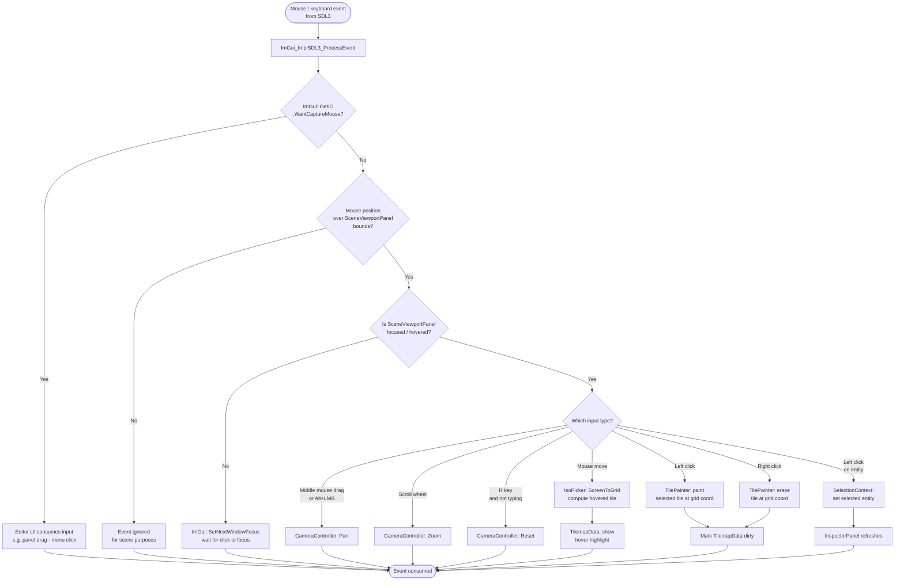

Phase 2C note:
- `R` resets the Scene Viewport camera only while the viewport is hovered or focused, and it is ignored while typing into an ImGui text field.

Phase 2D note:
- Hovered tile detection converts the mouse position from framebuffer-image space into viewport-local coordinates, then into engine-side isometric grid coordinates.
- The hovered tile highlight may be rendered from the previous frame's stored hover result so the framebuffer pass can still run before `ImGui::Image()`.

Phase 3D note:
- `File > Save Tilemap` and `File > Load Tilemap` currently operate only on the active debug `TilemapData` using the fixed MVP path `sandbox_project/tilemaps/debug_tilemap.json`.
- This workflow is intentionally tilemap-only and is not the final scene serialization pipeline.

Phase 3E note:
- `File > Save Tilemap` now reuses the current tilemap path when available.
- `File > Save Tilemap As...` and `File > Load Tilemap` use small ImGui modals scoped to `sandbox_project/tilemaps/`.
- The active tilemap path is editor-visible, but this remains project-local tilemap save/load rather than full scene persistence.

---

## 4 — Isometric Tile Painting Workflow

Shows the full path from user gesture to tilemap mutation.

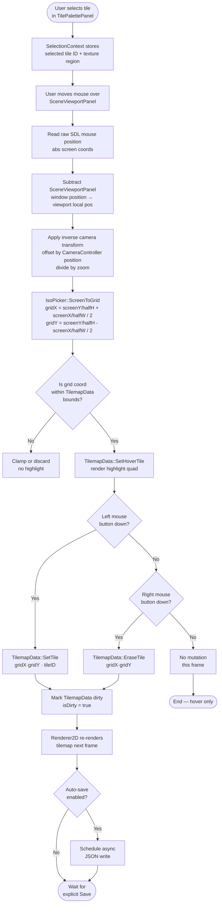

---

## 5 — Scene Save / Load Workflow

### 5a — Save Flow

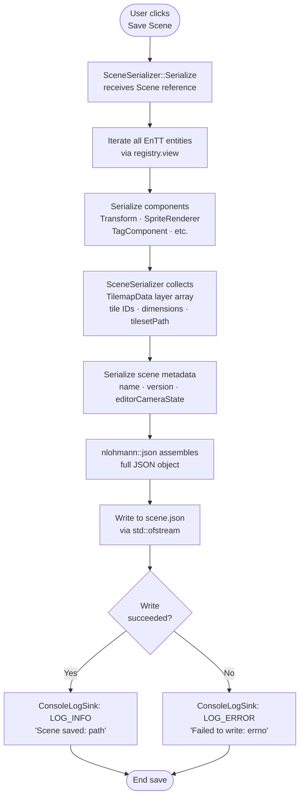

### 5b — Load Flow

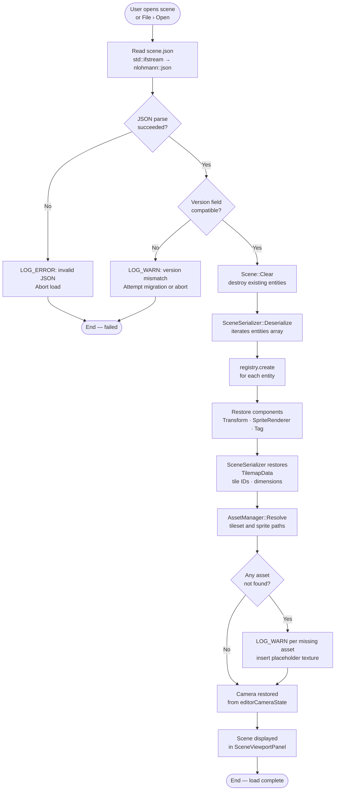

---

## 6 — Runtime / Editor Separation Workflow

Shows the strict boundary between editor code and runtime/engine code.

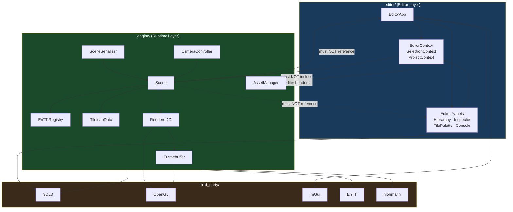

---

## 7 — Dependency Direction Diagram

Enforces the one-way dependency rule across all project layers.

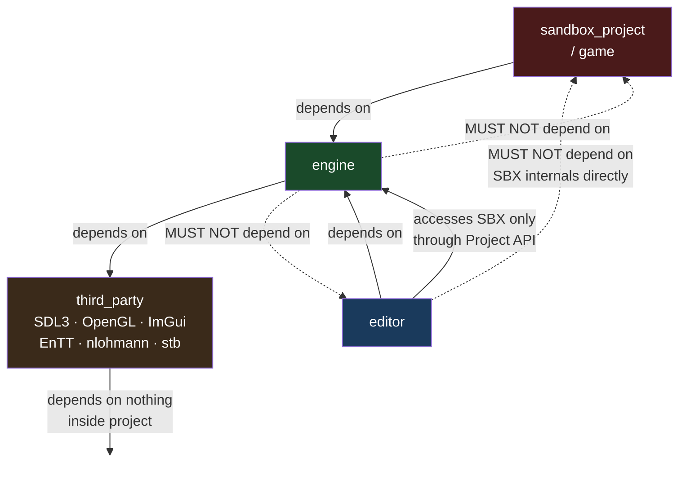

---

## 8 — Codex Task Workflow Diagram

The process Codex must follow for every assigned implementation task.

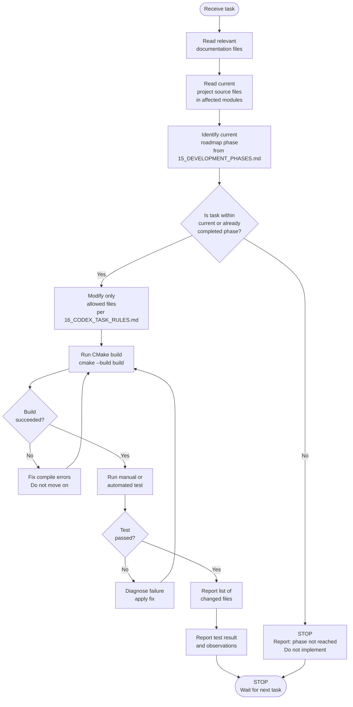

---

## 9 — MVP Development Roadmap Diagram

Visual representation of the phased build plan.

```mermaid
flowchart LR
    P0([Phase 0\nRepo & Docs\nSetup]) --> P1
    P1([Phase 1\nSDL3 + OpenGL\n+ ImGui Shell]) --> P2
    P2([Phase 2\nFramebuffer\nViewport]) --> P3
    P3([Phase 3\nIsometric Grid\nRendering]) --> P4
    P4([Phase 4\nCamera Pan\n& Zoom]) --> P5
    P5([Phase 5\nMouse Hover\nTile Detection]) --> P6
    P6([Phase 6\nConsole /\nLog Panel]) --> P7
    P7([Phase 7\nTilemap Data\nStructure]) --> P8
    P8([Phase 8\nTile Palette\nPanel]) --> P9
    P9([Phase 9\nTile Painting\n& Erasing]) --> P10
    P10([Phase 10\nTilemap JSON\nSave / Load]) --> P11
    P11([Phase 11\nEnTT Scene\nFoundation]) --> P12
    P12([Phase 12\nHierarchy\nPanel]) --> P13
    P13([Phase 13\nInspector\nPanel]) --> P14
    P14([Phase 14\nSprite\nRendering]) --> P15
    P15([Phase 15\nScene\nSave / Load])

    style P0 fill:#2a2a4a,color:#fff
    style P1 fill:#1a3a5c,color:#fff
    style P2 fill:#1a3a5c,color:#fff
    style P3 fill:#1a4a3a,color:#fff
    style P4 fill:#1a4a3a,color:#fff
    style P5 fill:#1a4a3a,color:#fff
    style P6 fill:#3a3a1a,color:#fff
    style P7 fill:#3a2a1a,color:#fff
    style P8 fill:#3a2a1a,color:#fff
    style P9 fill:#3a2a1a,color:#fff
    style P10 fill:#3a2a1a,color:#fff
    style P11 fill:#4a1a2a,color:#fff
    style P12 fill:#4a1a2a,color:#fff
    style P13 fill:#4a1a2a,color:#fff
    style P14 fill:#4a1a2a,color:#fff
    style P15 fill:#4a1a2a,color:#fff
```

---

## 10 — Editor Panel Communication Diagram

Shows how panels share state through context objects without directly coupling to each other.

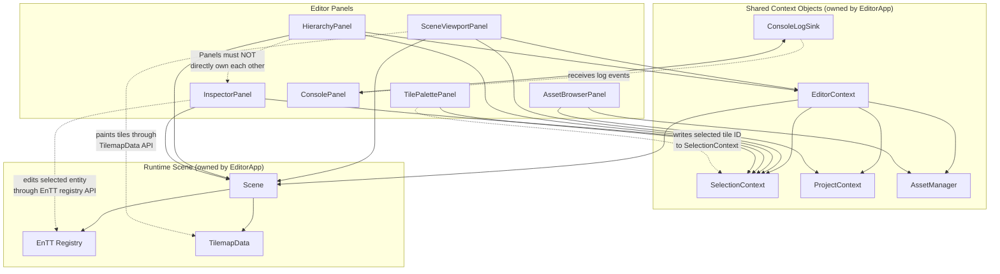

---

## 11 — OpenGL Framebuffer Viewport Sequence Diagram

Shows the frame-level sequence from render start to visible pixel on screen.

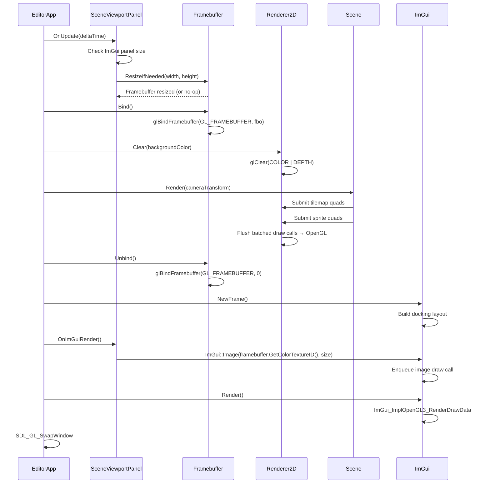

---

## 12 — Isometric Coordinate Conversion Diagram

Shows each transformation stage from raw mouse position to final tile index.

```mermaid
flowchart TD
    A([Mouse screen position\nSDL_GetMouseState\nabsX · absY]) --> B[Subtract SceneViewportPanel\nwindow position\n→ viewport local pos\nvpX = absX - panelX\nvpY = absY - panelY]
    B --> C[Apply inverse camera transform\nworldX = vpX / zoom - camOffsetX\nworldY = vpY / zoom - camOffsetY]
    C --> D["IsoPicker::ScreenToGrid\ngridX = (worldY / halfTileH + worldX / halfTileW) / 2\ngridY = (worldY / halfTileH - worldX / halfTileW) / 2\nwhere halfTileW = tileWidth / 2\n      halfTileH = tileHeight / 2"]
    D --> E[floor to integer\ntileCol = floor(gridX)\ntileRow = floor(gridY)]
    E --> F{Col and Row\nwithin TilemapData\nbounds?}
    F -- No --> G([Discard — out of bounds])
    F -- Yes --> H[TileIndex = tileRow * mapWidth + tileCol]
    H --> I[TilemapData::GetTile / SetTile\nusing TileIndex]
    I --> J[Renderer2D draws\nhover highlight quad at\nscreenX = tileCol − tileRow × halfTileW\nscreenY = tileCol + tileRow × halfTileH]
    J --> K([Tile highlighted / painted])
```

### Coordinate Formulas

**Grid → Screen** (used by Renderer2D to position quads):

```
screenX = (gridX - gridY) * tileWidth  / 2
screenY = (gridX + gridY) * tileHeight / 2
```

**Screen → Grid** (used by IsoPicker to pick tiles):

```
gridX = (screenY / (tileHeight / 2) + screenX / (tileWidth / 2)) / 2
gridY = (screenY / (tileHeight / 2) - screenX / (tileWidth / 2)) / 2
```

> **Important:** `screenX` and `screenY` in the Screen → Grid formula are **world-space** coordinates.  
> Before calling `ScreenToGrid`, the raw viewport-local mouse position must be adjusted by:
> 1. Subtracting the `SceneViewportPanel` offset to get viewport-local coordinates.
> 2. Dividing by `zoom` and adding the `CameraController` world offset to get world-space coordinates.  
> Skipping either step produces incorrect tile picks whenever the camera is panned or zoomed.

---

## How Codex Should Use These Diagrams

### 1 — Follow workflow order

Every diagram encodes a strict execution sequence. Codex must implement functions and calls in the order shown. For example, `Framebuffer::Bind` must happen **before** any `Renderer2D` draw calls, and `Framebuffer::Unbind` must happen **before** `ImGui::Image` is called. Reversing or skipping steps will produce black viewports or incorrect renders.

### 2 — Do not implement systems before their roadmap phase

Diagram 9 (MVP Roadmap) is the gating document. Codex must not write `TilemapData`, `TilePainter`, or `IsoPicker` code during Phase 1 (SDL3 shell), even if those classes are referenced in other diagrams. Each phase must compile and pass its own tests before the next phase begins.

### 3 — Use diagrams to understand allowed dependencies

Diagram 7 (Dependency Direction) is the law. If Codex finds itself `#include`-ing an editor header inside `engine/`, that is a dependency inversion and must be refactored. Diagram 6 (Runtime/Editor Separation) further clarifies which objects may hold references to which. When in doubt, check those two diagrams before adding any `#include`.

### 4 — Update diagrams when architecture changes

If a refactor changes the execution order, adds a new context object, or moves a module between layers, the corresponding diagram(s) in this file must be updated in the same commit. Stale diagrams will cause Codex (and human developers) to make incorrect assumptions. Treat diagrams as **living documentation**, not optional commentary.
